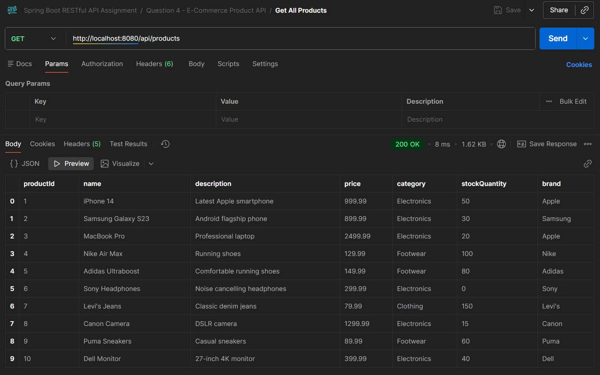
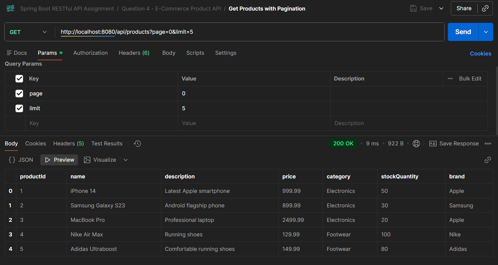
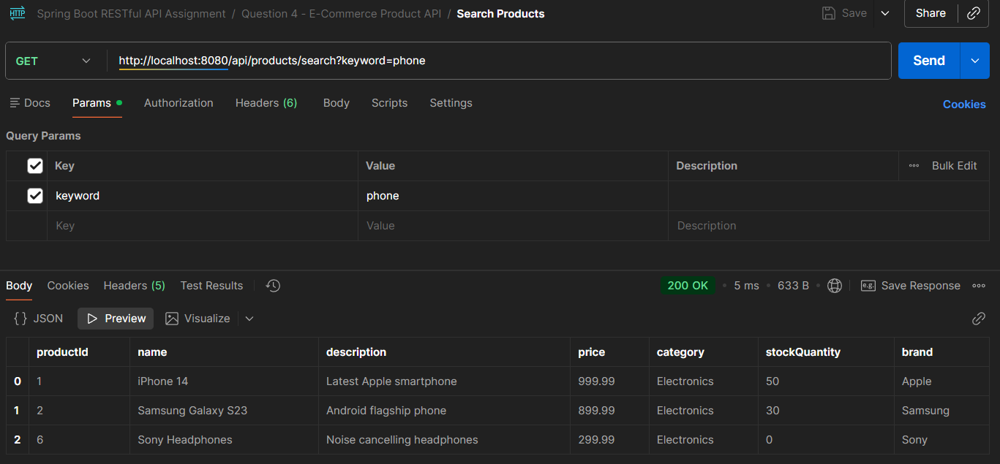
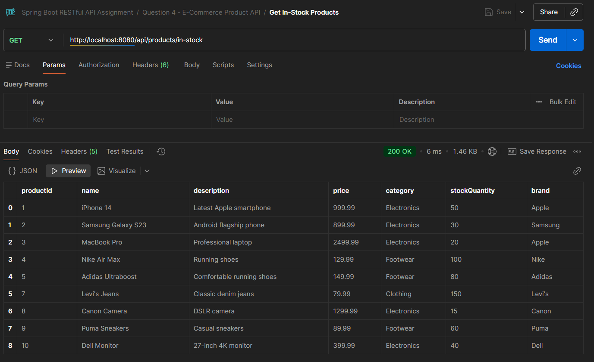

# E-Commerce Product API

A RESTful API built with Spring Boot for managing e-commerce products with PostgreSQL database integration.

## Features

- Complete CRUD operations for products
- Search and filter products by category, brand, price range
- Pagination support
- Stock management
- Duplicate product validation
- PostgreSQL database persistence

## Technologies Used

- Spring Boot 3.2.0
- Spring Data JPA
- PostgreSQL
- Maven
- Java 17

## Prerequisites

- Java 17 or higher
- Maven 3.6+
- PostgreSQL
- Postman (for testing)

## Database Setup

1. Create PostgreSQL database:
```sql
CREATE DATABASE ecommerce_db;
```

2. Update `src/main/resources/application.properties` with your PostgreSQL password:
```properties
spring.datasource.password=YOUR_PASSWORD
```

## Running the Application

```bash
mvn spring-boot:run
```

Application runs on: `http://localhost:8080`

## API Endpoints

### 1. Get All Products
**GET** `/api/products`
```
http://localhost:8080/api/products
```

### 2. Get Products with Pagination
**GET** `/api/products?page={page}&limit={limit}`
```
http://localhost:8080/api/products?page=0&limit=5
```

### 3. Get Product by ID
**GET** `/api/products/{id}`
```
http://localhost:8080/api/products/1
```

### 4. Get Products by Category
**GET** `/api/products/category/{category}`
```
http://localhost:8080/api/products/category/Electronics
```

### 5. Get Products by Brand
**GET** `/api/products/brand/{brand}`
```
http://localhost:8080/api/products/brand/Apple
```

### 6. Search Products by Keyword
**GET** `/api/products/search?keyword={keyword}`
```
http://localhost:8080/api/products/search?keyword=phone
```

### 7. Get Products by Price Range
**GET** `/api/products/price-range?min={min}&max={max}`
```
http://localhost:8080/api/products/price-range?min=100&max=500
```

### 8. Get In-Stock Products
**GET** `/api/products/in-stock`
```
http://localhost:8080/api/products/in-stock
```

### 9. Add New Product
**POST** `/api/products`

**Headers:** `Content-Type: application/json`

**Body:**
```json
{
  "name": "iPhone 15",
  "description": "Latest Apple smartphone",
  "price": 999.99,
  "category": "Electronics",
  "stockQuantity": 50,
  "brand": "Apple"
}
```

**Response:** `201 Created`

### 10. Update Product
**PUT** `/api/products/{id}`

**Headers:** `Content-Type: application/json`

**Body:**
```json
{
  "name": "iPhone 15 Pro",
  "description": "Latest Apple flagship smartphone",
  "price": 1199.99,
  "category": "Electronics",
  "stockQuantity": 30,
  "brand": "Apple"
}
```

**Response:** `200 OK` or `404 Not Found`

### 11. Update Stock Quantity
**PATCH** `/api/products/{id}/stock?quantity={quantity}`
```
http://localhost:8080/api/products/1/stock?quantity=100
```

**Response:** `200 OK` or `404 Not Found`

### 12. Delete Product
**DELETE** `/api/products/{id}`
```
http://localhost:8080/api/products/1
```

**Response:** `204 No Content` or `404 Not Found`

## API Screenshots

### Get All Products


### Get Products with Pagination


### Search Products by Keyword


### Get Products by Price Range


### Get In-Stock Products


### Get Products by Category


## Testing with Postman

### Example: Add a Product

1. Set method to **POST**
2. URL: `http://localhost:8080/api/products`
3. Headers: `Content-Type: application/json`
4. Body (raw JSON):
```json
{
  "name": "Samsung Galaxy S24",
  "description": "Latest Samsung flagship phone",
  "price": 899.99,
  "category": "Electronics",
  "stockQuantity": 30,
  "brand": "Samsung"
}
```
5. Click **Send**

### Example: Search Products

1. Set method to **GET**
2. URL: `http://localhost:8080/api/products/search?keyword=samsung`
3. Click **Send**

### Example: Filter by Price Range

1. Set method to **GET**
2. URL: `http://localhost:8080/api/products/price-range?min=500&max=1000`
3. Click **Send**

## HTTP Status Codes

- `200 OK` - Successful GET, PUT, PATCH requests
- `201 Created` - Successful POST request
- `204 No Content` - Successful DELETE request
- `404 Not Found` - Resource not found
- `409 Conflict` - Duplicate product name

## Project Structure

```
src/main/java/com/auca/restfulapi/
└── ecommerce/
    ├── model/
    │   └── Product.java
    ├── controller/
    │   └── ProductController.java
    └── repository/
        └── ProductRepository.java
```

## Database Schema

**Table:** `product`

| Column | Type | Constraints |
|--------|------|-------------|
| product_id | BIGINT | PRIMARY KEY, AUTO_INCREMENT |
| name | VARCHAR | NOT NULL, UNIQUE |
| description | VARCHAR | |
| price | DOUBLE | |
| category | VARCHAR | |
| stock_quantity | INTEGER | |
| brand | VARCHAR | |

## Author

Student ID: 26937

## Notes

- Product names must be unique
- All data persists in PostgreSQL database
- Tables are automatically created on application startup
- Use `spring.jpa.hibernate.ddl-auto=create-drop` to reset database on restart
